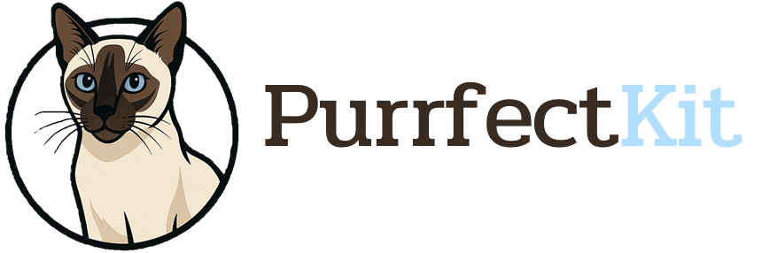

.. _readme:

PurrfectKit
===========

**PurrfectKit** is a whimsical Python library that combines feline charm with powerful natural language processing (NLP), optical character recognition (OCR), and document processing. Inspired by the elegance of Thai cat breeds, each module in the ``purrfectmeow`` package is named after a unique breed, making text processing, semantic search, and data extraction both fun and efficient.

Contents
--------

- `🐾 Overview <#overview>`_
- `🌟 Why PurrfectKit? <#why-purrfectkit>`_
- `🛠️ System-level Dependencies <#system-level-dependencies>`_
- `🚀 Installation <#installation>`_
- `🐱 Quick Start <#quick-start>`_
- `✨ Features <#features>`_
- `📚 Documentation <#documentation>`_
- `🤝 Contributing <#contributing>`_
- `📄 License <#license>`_

🐾 Overview
------------

PurrfectKit blends NLP, OCR, and document processing with a playful nod to Thai cat breeds. Its core modules are:

- **Kornja**: Segments text into manageable chunks (*Content Chunking*).
- **WichienMaat**: Interprets query intent for precise results (*Semantic Search*).
- **KhaoManee**: Converts text to vectors and manages storage (*Embedding & Storage*).
- **Malet**: Extracts data from PDFs, images, spreadsheets, and Markdown (*Text Extraction*).
- **Suphalaks**: Handles file operations and model/tokenizer loading (*Utility & Infrastructure*).

.. note::

   All modules are prefixed with ``purrfectmeow`` for namespace clarity and reflect Thai cat breed names.

🌟 Why PurrfectKit?
--------------------

- **Playful yet Powerful**: Combines robust NLP and OCR capabilities with a delightful, cat-inspired interface.
- **Multilingual Mastery**: Built-in support for Thai via ``pythainlp``, with extensibility for other languages.
- **Developer-Friendly**: Intuitive APIs and comprehensive documentation make integration a breeze.
- **Versatile Applications**: Perfect for semantic search, document processing, and retrieval-augmented generation (RAG).

🛠️ System-level Dependencies
-----------------------------

PurrfectKit relies on the following system-level dependencies for OCR and document processing. Install them based on your operating system:

- **tesseract-ocr**: Core OCR engine for text extraction from images.
- **tesseract-ocr-tha**: Thai language data for Tesseract.
- **poppler**: PDF rendering library for processing PDF documents.
- **ffmpeg**: Multimedia framework for handling image and video inputs.
- **libmagic1**: File type identification library for robust file handling.

Installation on Ubuntu/Debian::

   sudo apt-get update
   sudo apt-get install tesseract-ocr tesseract-ocr-tha poppler-utils ffmpeg libmagic1

Installation on macOS (using Homebrew)::

   brew install tesseract tesseract-lang poppler ffmpeg libmagic

Installation on Windows:

- **tesseract-ocr**: Download from https://github.com/UB-Mannheim/tesseract/wiki. Install with Thai language and add Tesseract-OCR folder to PATH.
- **Poppler**: Download from https://github.com/oschwartz10612/poppler-windows/releases/. Extract, and add bin folder to PATH.
- **FFmpeg**: Get a static build from https://ffmpeg.org/download.html, extract, and add bin folder to PATH.

🚀 Installation
----------------

PurrfectKit requires **Python 3.10 to 3.12.4**. We recommend using ``uv`` for faster dependency management, but ``pip`` is also supported.

Using ``uv`` (Recommended)::

   git clone https://github.com/SUWALUTIONS/PurrfectKit.git
   cd PurrfectKit
   uv sync --extra-index-url https://download.pytorch.org/whl/cpu

Using ``pip``::

   git clone https://github.com/SUWALUTIONS/PurrfectKit.git
   cd PurrfectKit
   pip install . --extra-index-url https://download.pytorch.org/whl/cpu

For development dependencies (e.g., ``pytest``)::

   uv sync --extra-index-url https://download.pytorch.org/whl/cpu --extra dev
   # or
   pip install .[dev] --extra-index-url https://download.pytorch.org/whl/cpu

🐱 Quick Start
---------------

.. code-block:: python

   from purrfectmeow import Suphalaks, Malet, Kornja, KhaoManee, WichienMaat

   # Load and process a PDF
   file_path = "example/meowdy.pdf"
   metadata = Suphalaks.get_file_metadata(file_path)

   with open(file_path, "rb") as f:
       text = Malet.loader(f, file_path, loader="MARKITDOWN")

   # Chunk the text
   chunks = Kornja.chunking(
       text,
       splitter="token",
       model_name="intfloat/multilingual-e5-large-instruct",
       chunk_size=50,
       chunk_overlap=0
   )

   # Create document templates and embeddings
   docs = Suphalaks.get_document_template(chunks, metadata)
   embeddings = KhaoManee.get_embeddings(docs, model_name="intfloat/multilingual-e5-large-instruct")
   query_embeddings = KhaoManee.get_query_embeddings(query="howdy", model_name="intfloat/multilingual-e5-large-instruct")

   # Perform semantic search
   results = WichienMaat.get_search(query_embeddings, embeddings, docs, top_k=2)

   # Print results
   for result in results:
       print(f"Score: {result['score']:.4f}")
       print(f"Content: {result['document'].page_content}\\n")

Expected Output::

   [
     {
       "score": 0.8146,
       "document": {
         "metadata": {
           "chunk_info": {
             "chunk_number": 1,
             "chunk_id": "fc690110e8a2407db6b65e7129331ec7",
             "chunk_hash": "4b7ffc7f57494fba188f7bc55d348a7c",
             "previous_chunk_hash": null,
             "next_chunk_hash": "49473745424e819315a4ad8cb2c25fa8",
             "chunk_size": 168
           },
           "source_info": {
             "file_name": "meowdy.pdf",
             "file_size": 3981724,
             "file_created_date": "2025-05-23 09:46:17",
             "file_modified_date": "2025-05-23 09:46:17",
             "file_extension": ".pdf",
             "file_type": "application/pdf",
             "description": "PDF document, version 1.7, 1 pages",
             "total_pages": 1,
             "file_md5": "bf4db19df52cb3a3e4e3854c9edbdc73"
           }
         },
         "page_content": "Meowdy, marvelous makers of machine magic! PurrfectKit. Whether you're chunking, searching, embedding, extracting, or orchestrating, I've got a cat for that"
       }
     },
     ...
   ]

✨ Features
------------

- **NLP**: Tokenization, semantic analysis and more with ``spacy``, ``pythainlp``, and ``transformers``.
- **OCR**: Extract text from images and PDFs using ``surya-ocr``, ``easyocr``, and ``pytesseract``.
- **Document Processing**: Handle PDFs, images, and Markdown with ``pymupdf``, ``docling`` and ``markitdown``.
- **Multilingual Support**: Thai language processing via ``pythainlp``, extensible for other languages.
- **AI & LLMs**: Leverage ``torch`` and ``langchain-core`` for embeddings and RAG workflows.
- **Whimsical Design**: Thai cat breed-inspired module names for a delightful developer experience.

📚 Documentation
-----------------

- Usage Guide: Step-by-step examples for all modules.
- API Reference: Detailed documentation for ``purrfectmeow`` modules.
- GitHub Repository: https://github.com/SUWALUTIONS/PurrfectKit

🤝 Contributing
----------------

We welcome contributions! To get started:

1. Fork the repository.
2. Create a branch: ``git checkout -b feature/your-feature``.
3. Commit changes: ``git commit -m "Add your feature"``.
4. Push and open a pull request.

See `CONTRIBUTING <CONTRIBUTING>`_ for detailed guidelines.

📄 License
-----------

PurrfectKit is released under the `MIT License <LICENSE>`_.